# 🏭 Clasificador Rojo — Gemelo Digital de una Célula Industrial 4.0

> Banda transportadora → cámara detecta caja **roja** → la banda se detiene → el **UR5e** la toma con **MoveIt 2** → la coloca sobre un **TurtleBot 3** → el TurtleBot la lleva con **Nav 2** a la estación de recolección → la banda se reactiva. **Todo arranca/se detiene por MQTT.** Implementado **100 % en software** como gemelo digital en **Webots + ROS 2**.

Este proyecto es la materialización del patrón de **Industria 4.0** del curso: **PLC → MQTT → ROS 2 → decisión/IA → comandos de vuelta**, sin hardware industrial real.

| | |
|---|---|
| **SO** | WSL2 · Ubuntu 24.04 |
| **Middleware** | ROS 2 Jazzy |
| **Simulador (gemelo digital)** | Webots R2025a + `webots_ros2` |
| **Broker MQTT** | EMQX (grado industrial) |
| **Manipulación** | MoveIt 2 (UR5e) |
| **Navegación** | Nav 2 (TurtleBot 3) |
| **Lenguajes** | C++ (`rclcpp`, OpenCV) + Python |
| **Repo** | github.com/joseIronMaker/clasificador_rojo |

---

## 📑 Tabla de contenido
1. [La célula en una imagen](#1-la-célula-en-una-imagen)
2. [Arquitectura por capas — la pirámide de automatización](#2-arquitectura-por-capas--la-pirámide-de-automatización)
3. [Arquitectura del sistema (componentes)](#3-arquitectura-del-sistema-componentes)
4. [MQTT en el proyecto (Parte A del curso)](#4-mqtt-en-el-proyecto--parte-a)
5. [ROS-Industrial en el proyecto (Parte B)](#5-ros-industrial-en-el-proyecto--parte-b)
6. [El grafo de ROS 2](#6-el-grafo-de-ros-2)
7. [El ciclo completo (secuencia y estados)](#7-el-ciclo-completo)
8. [El gemelo digital — y por qué Webots (Parte C)](#8-el-gemelo-digital--y-por-qué-webots)
9. [Monitoreo de condición y mantenimiento predictivo](#9-monitoreo-de-condición-y-mantenimiento-predictivo)
10. [Edge vs. Cloud — dónde corre la inteligencia](#10-edge-vs-cloud)
11. [Cómo ejecutar](#11-cómo-ejecutar)
12. [Estructura del repositorio](#12-estructura-del-repositorio)

---

## 1. La célula en una imagen

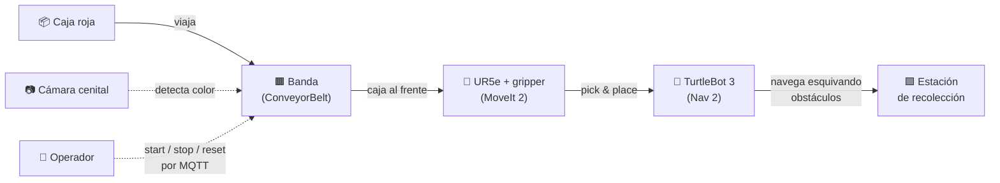

---

## 2. Arquitectura por capas — la pirámide de automatización

El proyecto reproduce los **niveles ISA-95 / Industria 4.0**: campo (OT) → mensajería (IIoT) → supervisión (IT). MQTT es el pegamento entre el mundo OT y el mundo IT.

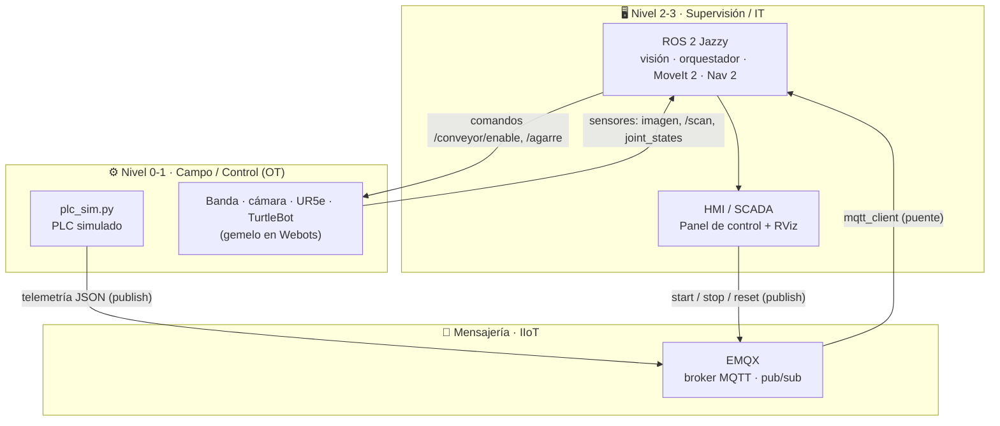

**Idea clave:** ni el operador ni el PLC hablan ROS; hablan **MQTT**. El puente `mqtt_client` traduce MQTT ↔ ROS 2. Así un PLC, un SCADA o un dashboard en la nube pueden mandar órdenes sin saber nada de ROS — exactamente la promesa del IIoT.

---

## 3. Arquitectura del sistema (componentes)

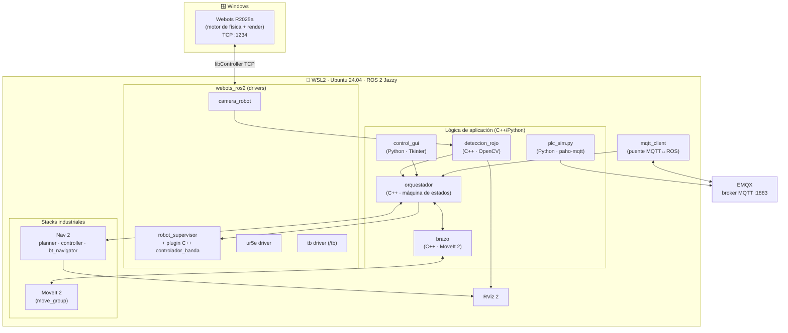

---

## 4. MQTT en el proyecto — Parte A

El curso define MQTT como el protocolo **publish/subscribe** ligero del IIoT. Aquí lo usamos para **desacoplar al operador (y al PLC) de ROS 2**.

### 4.1 Topics MQTT del proyecto

| Topic MQTT | Sentido | Payload | Concepto del curso |
|---|---|---|---|
| `banda/comando` | operador → planta | `start` / `stop` / `reset` (texto) | *publish/subscribe*, comando |
| `planta/plc/estado` | PLC → SCADA | JSON (telemetría a 1 Hz) | telemetría QoS 0, *retained* |
| `planta/estado` | planta → nube | JSON (estado del ciclo) | *ros2mqtt* |

### 4.2 El puente MQTT ↔ ROS 2

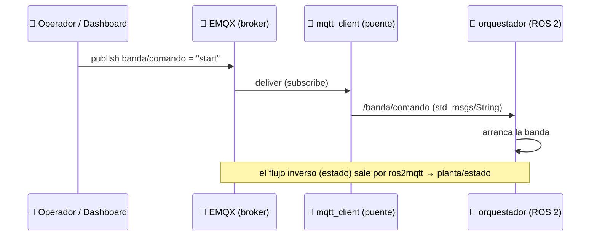

El paquete `ros-jazzy-mqtt-client` (config en [`config/mqtt_params.yaml`](config/mqtt_params.yaml)) hace el *bridge* en modo `primitive` (texto ↔ `std_msgs/String`). `plc_sim.py` usa `paho-mqtt` puro para publicar telemetría del PLC.

### 4.3 Conceptos del curso, aplicados

- **QoS** — los comandos (`banda/comando`) son críticos → **QoS 1** (*at least once*). La telemetría del PLC (`monitor_condicion`) se publica con **QoS 1** y **retenida**.
- **Retained** — el último estado del PLC queda **retenido**: un dashboard que se conecta tarde ve el estado actual al instante. *(Aprendimos a limpiarlo con `mosquitto_pub -r -n` cuando un comando viejo quedaba pegado.)*
- **LWT (Last Will)** — **implementado**: `monitor_condicion` declara un *Last Will*; si el nodo de campo cae, el broker publica `{"estado":"OFFLINE"}` retenido y el dashboard detecta la caída.
- **Broker industrial** — usamos **EMQX** (no Mosquitto): escala a millones de conexiones y trae dashboard web (`:18083`), más cercano a un entorno real.

---

## 5. ROS-Industrial en el proyecto — Parte B

ROS-Industrial es la **capa que lleva ROS 2 a la manufactura**: drivers estandarizados + la abstracción `ros2_control`/MoveIt 2 + puentes al mundo OT.

### 5.1 La abstracción que hace todo intercambiable

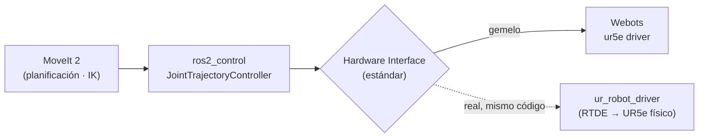

> En el curso usaste `ur_robot_driver` sin saber que era ROS-Industrial. La clave: **MoveIt 2 planifica contra un `Hardware Interface` estándar**; debajo puede haber el UR5e real (RTDE) o el gemelo (Webots) — **el código de planificación no cambia**. Esa es la propiedad que hace posible el gemelo digital.

En este proyecto, el nodo **`brazo`** (C++, `MoveGroupInterface`) planifica en **espacio de articulaciones** (5 configuraciones fijas obtenidas por IK con `/compute_ik`) y controla los dedos del gripper por `FollowJointTrajectory` — exactamente el patrón ROS-Industrial.

### 5.2 El puente ROS 2 ↔ PLC

El curso muestra dos puentes (MQTT y OPC-UA). Aquí implementamos el **MQTT** completo: `plc_sim.py` → EMQX → `mqtt_client` → ROS 2 → orquestador → comandos de vuelta. (El de OPC-UA con `asyncua` es el camino directo a un PLC Siemens S7 real, documentado como extensión.)

---

## 6. El grafo de ROS 2

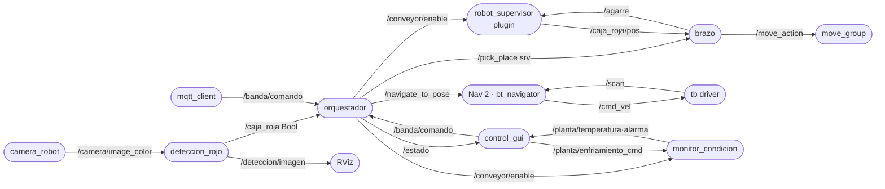

**Tabla de interfaces** (extracto):

| Interfaz | Tipo | Productor → Consumidor |
|---|---|---|
| `/camera/image_color` | `sensor_msgs/Image` | cámara → deteccion_rojo |
| `/caja_roja` | `std_msgs/Bool` | deteccion_rojo → orquestador |
| `/banda/comando` | `std_msgs/String` | mqtt_client / GUI → orquestador |
| `/conveyor/enable` | `std_msgs/Bool` | orquestador → plugin banda |
| `/agarre` | `std_msgs/String` | brazo/orquestador → plugin (teletransporte) |
| `/pick_place` | `std_srvs/Trigger` | orquestador → brazo |
| `/navigate_to_pose` | `nav2_msgs/action/NavigateToPose` | orquestador → Nav 2 |
| `/scan`, `/plan` | `LaserScan`, `Path` | TurtleBot/Nav 2 → costmaps |
| `/planta/temperatura` | `std_msgs/Float32` | monitor_condicion → panel / RViz |
| `/planta/alarma`, `/planta/enfriamiento` | `std_msgs/Bool` | monitor_condicion → panel |
| `/planta/enfriamiento_cmd` | `std_msgs/Bool` | panel → monitor_condicion (enfriar a mano) |

---

## 7. El ciclo completo

### 7.1 Secuencia

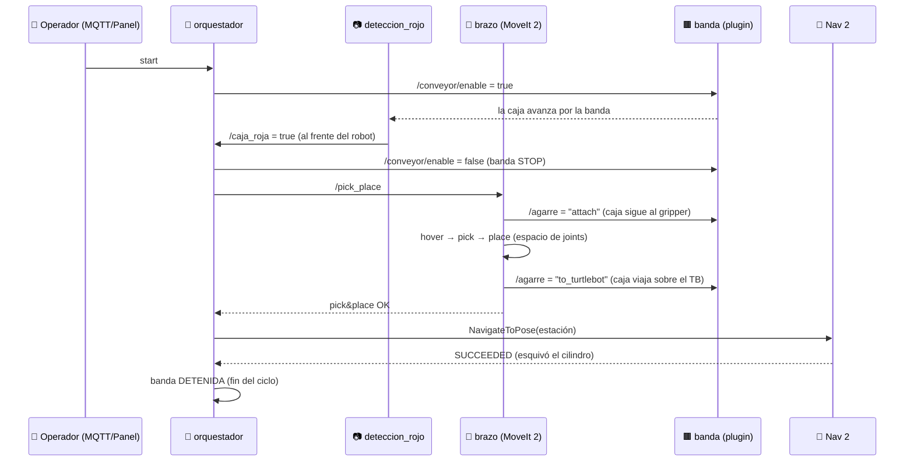

### 7.2 Máquina de estados del orquestador

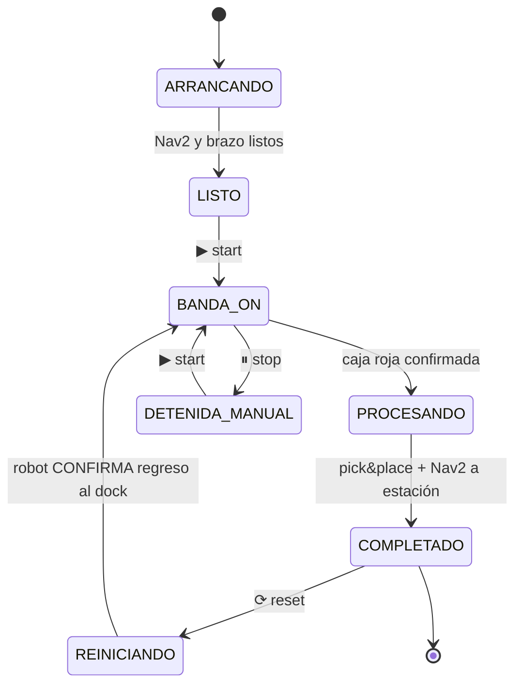

> **Decisión de diseño clave:** al reiniciar, la banda **solo arranca cuando el robot confirma (`SUCCEEDED`) que volvió al dock** — la zona donde el brazo coloca la pieza. Si la vuelta falla, la banda **sigue parada y reintenta**, nunca arranca "a ciegas".

---

## 8. El gemelo digital — y por qué Webots

Un **gemelo digital** es una réplica virtual del sistema físico que corre el **mismo software** que correría sobre el hardware real. Esa es la propiedad que hace valioso al gemelo: **lo que validas en simulación, lo despliegas en planta sin reescribir**.

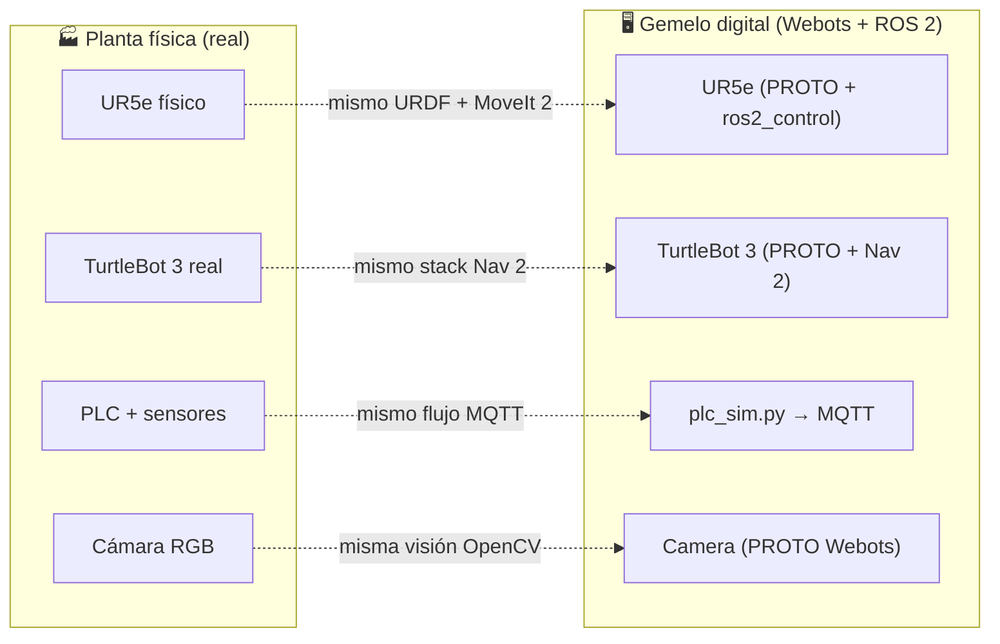

### 8.1 ¿Por qué Webots en vez de Gazebo?

El curso propone **ROS 2 + Gazebo** como gemelo digital. Elegimos **Webots**, y la decisión está justificada técnicamente:

| Criterio | 🟢 Webots | 🟡 Gazebo (Sim/Ignition) |
|---|---|---|
| **Modelos industriales listos** | UR5e, TurtleBot 3, **ConveyorBelt**, cámara, lidar, IMU, GPS como **PROTOs nativos** — la línea se arma casi sin ensamblar URDFs/plugins | hay modelos, pero más dispersos y a menudo requieren componer SDF/plugins a mano |
| **Misma abstracción ROS 2** | `webots_ros2` expone `ros2_control` / MoveIt 2 / Nav 2 estándar → **se cumple el "mismo código"** del gemelo | igual de válido (también cumple la abstracción) |
| **Ground truth / Supervisor API** | el `Supervisor` permite leer poses exactas y **manipular el mundo** (nuestro agarre por teletransporte, inyectar fallos) — ideal para escenarios de gemelo | requiere plugins/servicios adicionales |
| **Estabilidad y madurez** | simulador **integrado y estable**, multiplataforma (corre en Windows y se enlaza a ROS 2 en WSL2) | transición fragmentada *Classic → Gz* con churn de versiones/plugins |
| **Sensores integrados** | cámara, lidar, range finder con **interfaces ROS 2 nativas**, sin plugins externos | sensores vía plugins que hay que cablear |
| **Rendimiento en HW modesto** | render y física (ODE) eficientes; **funciona en WSL2 sin GPU** (este proyecto) | más pesado/sensible al backend gráfico |

**Conclusión:** para una **célula industrial heterogénea** (manipulador + AGV + banda + visión + IIoT) en hardware modesto, Webots da **más componentes industriales listos, una API de Supervisor que habilita escenarios de gemelo digital (manipulación sin física frágil, inyección de fallos) y la misma abstracción ROS 2 que Gazebo** — sin perder la propiedad del "mismo código". Es una elección igual de válida y, para este caso, más productiva.

> **Nota honesta:** el agarre se hace por **teletransporte controlado vía Supervisor** (no por física de contacto). En un gemelo digital esto es deseable: evita que el *solver* de física colapse al cerrar el gripper y permite escenarios reproducibles — una ventaja directa de la API de Webots.

---

## 9. Monitoreo de condición y mantenimiento predictivo

La célula no solo ejecuta el ciclo: **vigila la salud del motor de la banda** y cierra el lazo
*sensor → análisis → decisión → actuador* — el patrón de **mantenimiento predictivo** de la Industria 4.0.

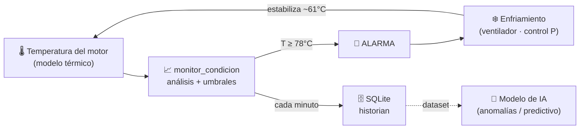

El nodo **`monitor_condicion`** modela la **temperatura del motor** de la banda (modelo térmico de
1.er orden: sube con la carga —banda + brazo—, baja hacia el ambiente). Webots no tiene un *device*
de temperatura, así que se **modela** — lo correcto en un gemelo. Al cruzar el umbral dispara una
**alarma** y un **sistema de enfriamiento** (ventilador con **control proporcional**) que **estabiliza**
la temperatura en una zona segura, en lugar de dejar que el motor se dañe.

| Umbral | Valor | Acción |
|---|---|---|
| **WARN** | 70 °C | aviso (zona naranja en la gráfica) |
| **ALARM** | 78 °C | **alarma** + enfriamiento **automático** |
| Consigna | ~61 °C | el control P sostiene una temperatura **plana** (verde) |
| Clear | 68 °C | la alarma se limpia (histéresis) |

**En el panel de control** se ve en vivo: la lectura de temperatura, una **gráfica temperatura-vs-tiempo**
con las líneas WARN/ALARM, el foco de **alarma**, y el botón **❄ Enfriamiento** manual (la banda cian
bajo la curva marca cuándo está enfriando). *Demo:* ▶ → la curva sube ~8 s → cruza ALARM → entra el
enfriamiento → la curva **baja y se estabiliza** en verde, la alarma se limpia.

### 9.1 Historian local (SQLite) → IA

Cada minuto, `monitor_condicion` guarda la telemetría en una **base de datos SQLite local**
(`~/proyecto_banda_ws/telemetria_motor.sqlite`, tabla `telemetria`: *timestamp, temperatura, alarma,
enfriamiento, banda, cajas*). Ese **histórico** es el dataset para **entrenar después un modelo de IA**
(detección de anomalías / predicción de fallos) — el paso *cloud / BI* del patrón Industria 4.0,
aquí materializado con datos reales del proceso.

> Con el monitor, el **MQTT del PLC** ya sale con **QoS 1**, **retained** y **Last Will (LWT)** de
> verdad: `monitor_condicion` declara su *Last Will* (`{"estado":"OFFLINE"}`) y publica la telemetría
> retenida en `planta/plc/estado`.

---

## 10. Edge vs. Cloud

¿Dónde corre la inteligencia? En esta célula, **todo el lazo de control está en el EDGE** (la propia máquina), por latencia y resiliencia:

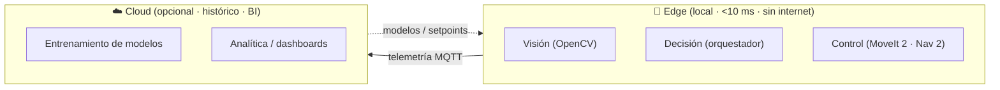

- **Edge** (aquí): detección de color, máquina de estados, planificación MoveIt 2 / Nav 2. Latencia mínima, funciona sin red.
- **Cloud** (extensión natural): el broker MQTT ya publica telemetría —y `monitor_condicion` la persiste en un **historian SQLite local**— que una nube (p. ej. Ignition + Sparkplug B, o AWS) puede consumir para histórico, BI y **entrenar** modelos de anomalías sobre esos datos, que luego se despliegan al edge.

---

## 11. Cómo ejecutar

```bash
# Compilar
cd ~/proyecto_banda_ws
colcon build --packages-select clasificador_rojo --symlink-install
source install/setup.bash

# Lanzar el flujo completo + GUI + RViz
ros2 launch clasificador_rojo lanzamiento_etapa3.py gui:=true
```

- La banda queda en **`LISTO`** — presiona **▶ Iniciar** en el panel (o `mosquitto_pub -t banda/comando -m start`).
- **▶ Iniciar / ⏸ Pausar / ⟳ Reiniciar** desde el panel Tkinter.
- **RViz** muestra la imagen de detección + el mapa, costmaps, ruta de Nav 2 y láser.
- Lanzamientos por etapa: `lanzamiento_etapa1.py` (banda+cámara+MQTT) · `etapa2` (+UR5e) · `etapa3` (+TurtleBot/Nav 2).

---

## 12. Estructura del repositorio

```
clasificador_rojo/
├── src/
│   ├── deteccion_rojo.cpp      # visión: HSV rojo → /caja_roja + /deteccion/imagen
│   ├── controlador_banda.cpp   # plugin C++ de Webots: banda + agarre por teletransporte
│   ├── orquestador.cpp         # máquina de estados + clientes MoveIt/Nav2
│   └── brazo.cpp               # MoveIt 2 (espacio de joints) + gripper
├── scripts/
│   ├── monitor_condicion.py    # mantenimiento predictivo: temperatura + alarma + enfriamiento + historian SQLite
│   ├── plc_sim.py              # PLC simulado → MQTT (paho-mqtt) [reemplazado por monitor_condicion]
│   ├── control_gui.py          # panel: start/pause/reset + gráfica temperatura/alarma/enfriamiento
│   └── genera_mapa.py          # genera el mapa del recinto (sin SLAM)
├── plugins/                    # descripción pluginlib del plugin C++
├── worlds/  mundo_banda.wbt    # el gemelo digital: banda, cámara, UR5e, TurtleBot, paredes, obstáculo
├── urdf/                       # UR5e+gripper, TurtleBot, cámara, supervisor
├── config/                     # ros2_control, MoveIt, Nav2, mapa, MQTT, RViz
└── launch/                     # lanzamiento_etapa1/2/3.py
```

---

*Proyecto final — Robótica y Automatización · MQTT + ROS-Industrial · Gemelo digital en Webots + ROS 2.*
